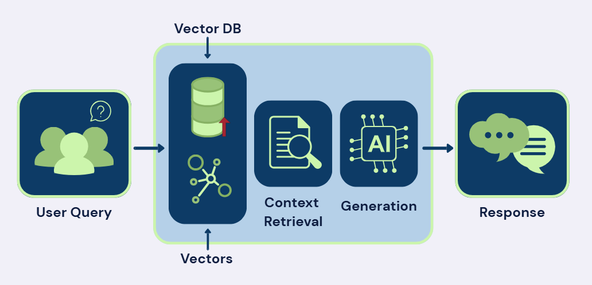

# A Beginner’s Guide to the Wizarding World

Harry Potter Retrieval-Augmented Generation (RAG) Assistant

**Project Description**

This project is a Retrieval-Augmented Generation (RAG) assistant designed to help new fans learn about the Harry Potter universe. The assistant answers questions using a curated collection of documents rather than relying only on a language model’s general knowledge.

The goal of this project is to make information about the Harry Potter series more accessible to beginners by providing clear, accurate, and engaging explanations supported by retrieved sources.

The assistant is deployed as an interactive Streamlit application.

---

**Domain Overview and Problem Statement**

The Harry Potter universe includes seven books, eight films, and a large number of characters, locations, and storylines. While the series is widely known, the amount of information can be overwhelming for someone who is just getting started.

Many people who are curious about the series may not know where to begin or which details are most important. This project addresses that problem by creating an assistant that focuses on foundational knowledge, such as major characters, key events, and central themes, while presenting information in a clear and beginner-friendly way.

---

**Architecture Overview (RAG Pipeline)**

This assistant is built using a Retrieval-Augmented Generation (RAG) architecture. The system combines document retrieval with a language model to generate responses grounded in the project’s document collection.

**Pipeline Overview:**
1. _Document Collection:_ A curated set of documents related to the Harry Potter universe is collected and preprocessed.
2. _Vector Database:_ The documents are embedded and stored in a DuckDB-based vector database. This allows the system to retrieve relevant passages based on a user’s query.
3. _Retrieval Step:_ When a user submits a question, the system retrieves the most relevant document chunks from the vector database.
4. _Generation Step_: The retrieved content is passed to a language model, which generates a response grounded in those sources.
5. _Streamlit Deployment:_ The assistant is deployed using Streamlit, allowing users to interact with the system through a simple web interface.

---

**Document Collection Summary**

The document collection includes a mix of formats to provide a well-rounded knowledge base:

_PDF Files:_

PDFs include structured content such as chapter summaries and character analyses. These documents provide clear overviews of plot points, character motivations, and key events. Their structured format makes them well-suited for chunking and retrieval.

_HTML Files:_

HTML files consist of web articles and guides that explore different aspects of the Harry Potter universe. These sources often use a conversational tone and include reflections, facts, and thematic discussions, making them accessible to newcomers while still offering meaningful insights.

_YouTube Transcripts:_

YouTube transcripts capture discussions, reviews, and analyses from fans and commentators. These sources introduce informal perspectives, rankings, and opinions, which add variety and depth to the assistant’s responses.

_Why This Combination?_
* PDFs provide structured and reliable summaries
* HTML files offer engaging and approachable explanations
* YouTube transcripts add diverse viewpoints and informal insights

Together, these documents allow the assistant to answer a wide range of beginner-focused questions.

---

**Agent Configuration**

The assistant is configured with a defined role, goal, and backstory to guide how it responds to user questions.

* _Role:_ The agent acts as an educational guide for users who are new to the Harry Potter universe. This role was chosen to encourage explanatory responses that focus on clarity rather than assuming prior knowledge.
* _Goal:_ The agent’s goal is to answer questions accurately using retrieved documents from the project’s knowledge base. Defining this goal helps prioritize grounded responses over speculative or unsupported information.
* _Backstory:_ The agent is framed as a knowledgeable but approachable guide. This backstory supports a beginner-friendly tone and helps the agent present information in a structured and accessible way.

Explicitly defining the agent’s role and goal helps align the system’s behavior with the project’s objective of introducing foundational Harry Potter concepts. The backstory reinforces an explanatory style while remaining consistent with the use of retrieved sources.

---

**Installation and setup instructions**
To run this project locally, follow these steps:
1)_ Clone the repository:_
   
   git clone <YOUR_GITHUB_REPOSITORY_URL>

3)_ Navigate to the project directory:_
   
   cd <YOUR_REPOSITORY_NAME>

5)_ Install the required dependencies:_
   
   pip install -r requirements.txt

7)_ Ensure the database is available:_
   
   backend/Harry (8).duckdb

9) _Run the application:_
    
   streamlit run app.py

11)_ Enter your OpenAI API Key_

Once the app is up and running, enter the OpenAI API Key and confirm the database connection

---

**Link to Streamlit Deployment**

You can access the live version of the assistant at the following link:
[Live Harry Potter Assistant](https://abrugadalpprag-fw7ym4fsutsyjejevsvvab.streamlit.app/) 

